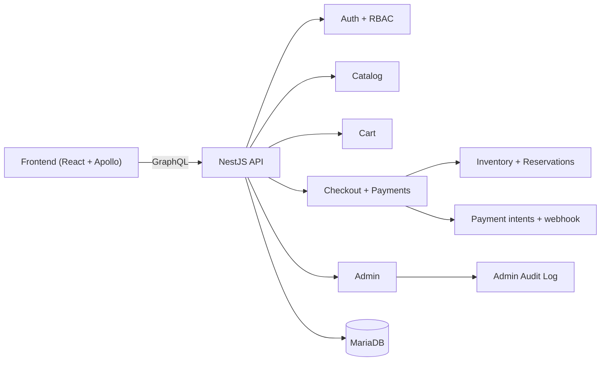

# Architecture Overview

## Boundaries
- Frontend (`soren-front-end-master`): CRA + TypeScript + MUI + Apollo Client.
- Backend (`soren-back-end-origin`): NestJS + GraphQL + TypeORM + MariaDB.
- Infrastructure: local Docker Compose for API + DB orchestration.

## Module map

## Runtime notes
- GraphQL schema is generated at `/Users/danielwellz/Work/Soren Express/soren-back-end-origin/schema.gql`.
- REST endpoint `/payments/webhook` is used for webhook-like confirmation events.
- Legacy backend trees were quarantined under `/Users/danielwellz/Work/Soren Express/legacy/backend` and excluded from runtime.
