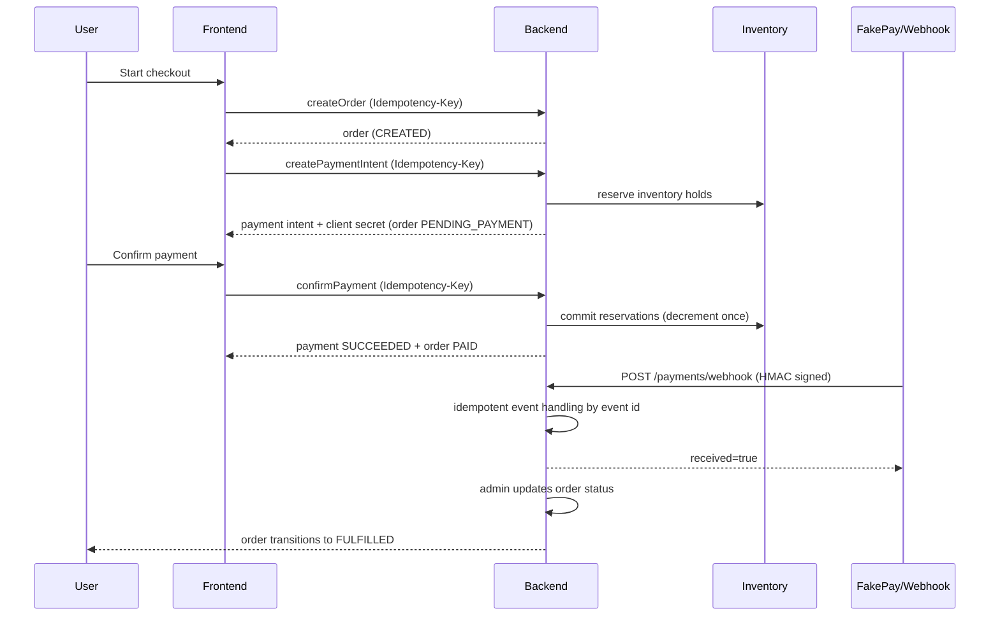

# Checkout Flow

```mermaid
sequenceDiagram
  participant U as User
  participant FE as Frontend
  participant API as Backend
  participant INV as Inventory
  participant PAY as FakePay/Webhook

  U->>FE: Start checkout
  FE->>API: createOrder (Idempotency-Key)
  API-->>FE: order (CREATED)

  FE->>API: createPaymentIntent (Idempotency-Key)
  API->>INV: reserve inventory holds
  API-->>FE: payment intent + client secret (order PENDING_PAYMENT)

  U->>FE: Confirm payment
  FE->>API: confirmPayment (Idempotency-Key)
  API->>INV: commit reservations (decrement once)
  API-->>FE: payment SUCCEEDED + order PAID

  PAY->>API: POST /payments/webhook (HMAC signed)
  API->>API: idempotent event handling by event id
  API-->>PAY: received=true

  API->>API: admin updates order status
  API-->>U: order transitions to FULFILLED
```

## State machine
- `CREATED -> PENDING_PAYMENT -> PAID -> FULFILLED`
- Invalid transitions are rejected in backend state-machine checks.
