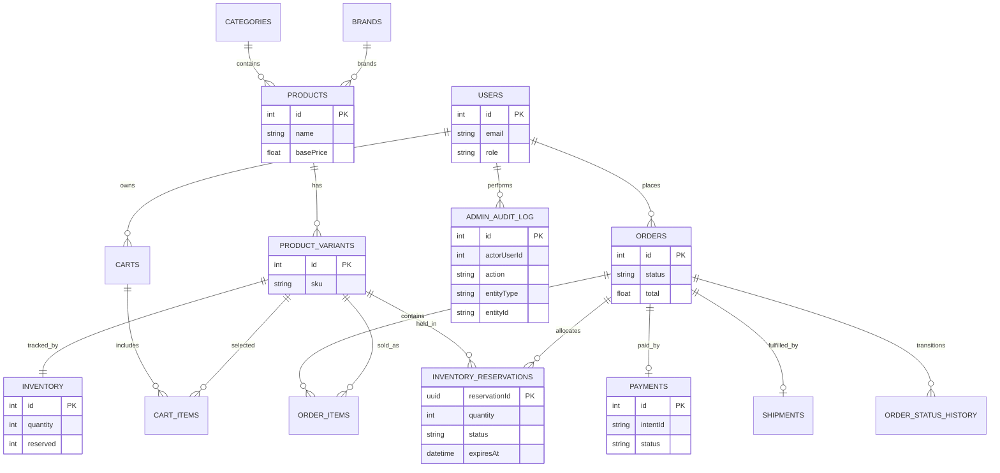

# ERD (Core Commerce)

```mermaid
erDiagram
  USERS ||--o{ ORDERS : places
  USERS ||--o{ CARTS : owns
  USERS ||--o{ ADMIN_AUDIT_LOG : performs

  CATEGORIES ||--o{ PRODUCTS : contains
  BRANDS ||--o{ PRODUCTS : brands
  PRODUCTS ||--o{ PRODUCT_VARIANTS : has
  PRODUCT_VARIANTS ||--|| INVENTORY : tracked_by

  CARTS ||--o{ CART_ITEMS : includes
  PRODUCT_VARIANTS ||--o{ CART_ITEMS : selected

  ORDERS ||--o{ ORDER_ITEMS : contains
  PRODUCT_VARIANTS ||--o{ ORDER_ITEMS : sold_as

  ORDERS ||--o| PAYMENTS : paid_by
  ORDERS ||--o| SHIPMENTS : fulfilled_by
  ORDERS ||--o{ ORDER_STATUS_HISTORY : transitions

  PRODUCT_VARIANTS ||--o{ INVENTORY_RESERVATIONS : held_in
  ORDERS ||--o{ INVENTORY_RESERVATIONS : allocates

  USERS {
    int id PK
    string email
    string role
  }
  PRODUCTS {
    int id PK
    string name
    float basePrice
  }
  PRODUCT_VARIANTS {
    int id PK
    string sku
  }
  INVENTORY {
    int id PK
    int quantity
    int reserved
  }
  ORDERS {
    int id PK
    string status
    float total
  }
  PAYMENTS {
    int id PK
    string intentId
    string status
  }
  INVENTORY_RESERVATIONS {
    uuid reservationId PK
    int quantity
    string status
    datetime expiresAt
  }
  ADMIN_AUDIT_LOG {
    int id PK
    int actorUserId
    string action
    string entityType
    string entityId
  }
```
